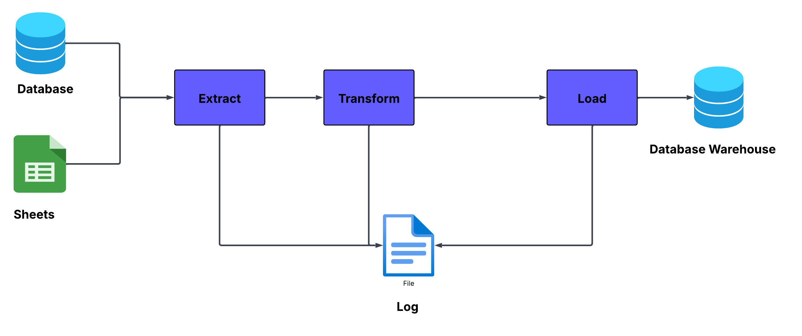

# README
## Project Description

This project is designed to integrate data from multiple sources into a data warehouse. The transactional data source is scattered across databases and CSV files. Create efficient ETL (Extract, Transform, Load) processes to consolidate and prepare the data for analysis. The implementation of a data pipeline using Docker and PySpark.

## Prerequisites

Before you begin, ensure you have met the following requirements:
- Docker installed on your local machine

### Setup Instructions

1. Clone the repository to your local machine.
2. Navigate to the project directory.

### Running the Project

To build and run the project, execute the following commands in your terminal:

```bash
docker compose build --no-cache
docker compose up -d
```

After the containers are up and running, if the library and dependency is not instlled. you can install manual:

```bash
docker exec -it pyspark_container pip install sqlalchemy psycopg2-binary
```

To access Jupyter Notebook on the PySpark container, check the container logs to get the token:

```bash
docker logs pyspark_container
```

example
```bash
http://127.0.0.1:8888/lab?token=3fa3b1cf2c67643874054971f23ee59bdee283b373794847
```

## Dataset
1. **Source Database (`source_db` container)**  
   - A PostgreSQL database that contains structured data related to banking transactions.
   - Tables include  :
     - `education_status`, 
     - `marital_Status`, 
     - `marketing_campaign_deposit`,
     -  and others.

2. **CSV File (`/script/data/new_bank_transaction.csv`)**  
   - A large dataset containing transactional records.
   - Requires transformation before loading into the Data Warehouse.

## Problem Statement

There are several challanges that need to be done before load it into Warehouse. Some of them are:

- Data might be spread across multiple sources (Database,CSV)
- Large file sizes that can strain computational resources
- Unstructured or poorly organized data
- Data not in the required format


## Solution

To solve these problems we will do two steps :

1. Exploratory Data Analysis (EDA), to understand the dataset
2. Implement ETL pipeline 


### Exploratory Data Analysis (EDA)

This step can be seen in file `Data Exploration.ipynb`.

### Data Pipeline Design



- **Source Layer**
  - Connect to `source_db` 
  - Extract all tables (e.g. `education_status`,`marital_status`, etc.)
  - Extract `new_bank_transactions.csv` sheets
  - Transform data: normalize, deduplicate, convert data types
- **Warehouse Layer**
  - Load transformed data into warehouse database

### Logging

All logs generated during the execution of the data pipeline are saved in the following file:

```plaintext
/script/log/log.info
```

